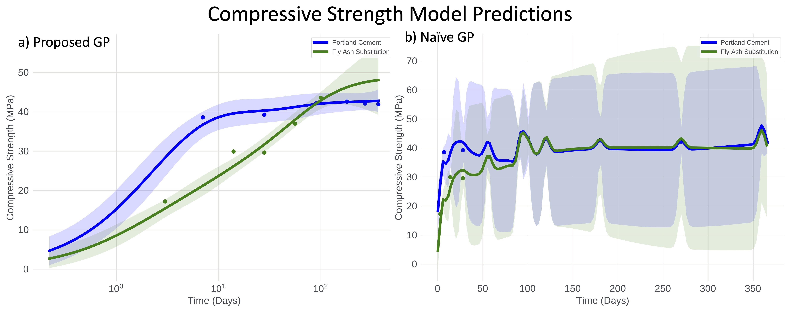
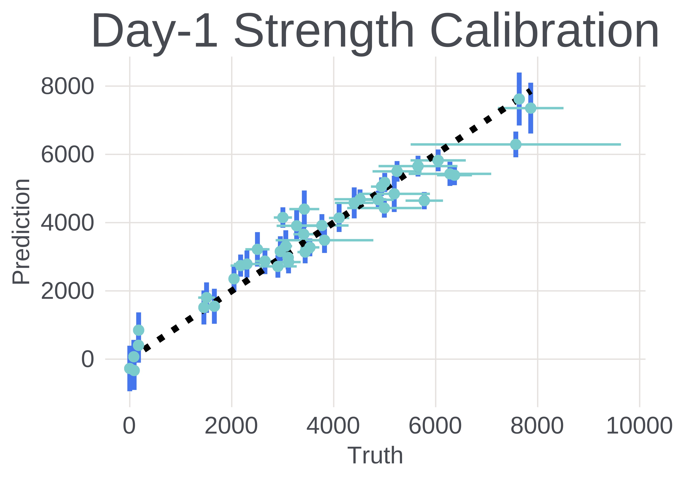
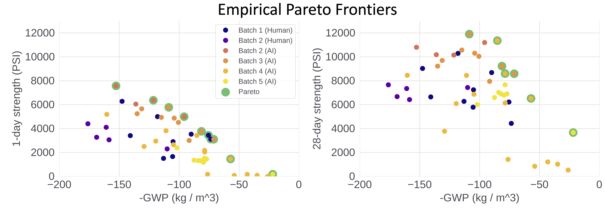
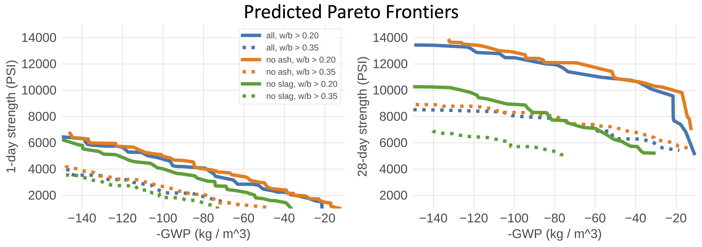

# Sustainable Concrete via Bayesian Optimization

Concrete is responsbile for up to **8% of anthropogenic carbon dioxide emissions per year** - compared to less than 3% for all air travel - and urgently needs to be decarbonized in order to achieve a sustainable future.
We invite researchers and practitioners of both machine learning and civil engineering
to collaborate on discovering more sustainable concrete formulations that are applicable
to a wide array of construction projects, at scale.
For more information,
please see ["Sustainable Concrete via Bayesian Optimization"](https://arxiv.org/abs/2310.18288).

This repository contains probabilistic models and data for the
1) compressive strength of concrete / mortar and
2) the associated global warming potential (GWP),

as a function of their composition, consisting of
cement, slag, water, to name a few basic ingredients.
See the `models.py` file for implementation details.

The models can be used for a variety of tasks, including but not limited to
1) continuous-time strength predictions with uncertainty bands for a user-specified concrete mix, and
2) experimental design: suggesting promising concrete mixtures to be tested in a lab,
3) the computation of optimal strength-GWP trade-offs based on user-specified (possibly location-specific) constraints.

# Examples

## Compressive Strength Model

The `SustainableConcreteModel` in `models.py` contains a `strength_model`, which can be used to predict the evolution of concrete's compressive strength as a function of its composition, i.e. its ingredients, see also the `strength_model_tutorial.ipynb` in the `notebooks` folder.
The model is a Gaussian process (GP) and includes several custom modeling steps that make it fit and extropolate concrete strength values well.
The following figure shows the strength curve predictions of the proposed model (left),
and for a naive application of a GP (right)
both trained on the [UCI concrete strength dataset](https://archive.ics.uci.edu/dataset/165/concrete+compressive+strength).

<p align="center">
  
</p>

The figure shows predicted strength curves for two compositions:
portland cement (blue) and a mix with 30% fly ash substitution (green).
Notably, the naive model (right) does not perform well, while our proposed model yields physically plausible predictions with well calibrated uncertainty bands.

Further, when trained on the mortar-mix strength data contained in this repository,
the training set predictions also look sensible and well calibrated,
as the next figure shows.
<p align="center">
  
</p>

## Experimental Design

The probabilistic model for compressive strength can in addition be used to design new concrete mixtures that are likely to exhibit an optimal trade-off between strength and GWP.
The following figure shows the evolution of the empirical Pareto frontier,
i.e. the points with empirically optimal trade-offs,
as a function of our experimental batches.

<p align="center">
  
</p>

Importantly, the experimental design methodology has been able to propose mortar mixes
that have experimentally proven to exhibit superior trade-offs between GWP and strength
compared (orange-yellow) to human-designed mixes (blue-purple).

## Inferring Optimal Trade-Offs under Constraints

While the previous section focused on using the models to optimize the empirically observed trade-offs,
by proposing new experiments,
we can also use the trained model to predict what the optimal trade-offs between GWP and strength
are likely to look like under constraints on the concrete composition
that were not necessarily present during the training of the model.

In particular, the figure below shows the predicted Pareto frontiers
of GWP and strength subject to two constraints on the water-to-binder ratio,
i.e.:

1) water-to-binder ratio > 0.2 (solid lines), and
2) water-to-binder ratio > 0.35 (dashed lines),

as well as constraints on ingredients:

1) no constraints (blue),
2) no fly ash (orange), and
3) no slag (green).

<p align="center">
  
</p>

Notably, while the figure is purely based on model predictions,
the trends in the figure conform to expert knowledge.
In particular,
- the increase in the minimum water-to-binder ratio has an outsize negative effect
on the evolution of strength,
- removing fly ash from the composition appears to have negligible effect during the time window we consider (< 28 days), and
- removing slag from the composition has a signficiant negative effect on strength, similar to the increase in the water-to-binder ratio.

These are just a few insights we can gain from querying the model,
and we believe that many more questions about the behavior of concrete
can be investigated in a similar way.

From a practical perspective, the insight that the exclusion of slag - a by-product of steel production -
is more signficiant than the exlusion of fly ash - a by-product of coal power plants -
can inform site selection
for large construction projects that seek to minimize carbon impact.


# Citing

If you use the data or models contained in this repository, please cite
["Sustainable Concrete via Bayesian Optimization"](https://arxiv.org/abs/2310.18288):
```
@misc{ament2023sustainable,
      title={Sustainable Concrete via Bayesian Optimization},
      author={Sebastian Ament and Andrew Witte and Nishant Garg and Julius Kusuma},
      year={2023},
      eprint={2310.18288},
      archivePrefix={arXiv},
      primaryClass={cs.LG}
}
```

## License
`SustainableConcrete` is MIT licensed, as found in the LICENSE file.
