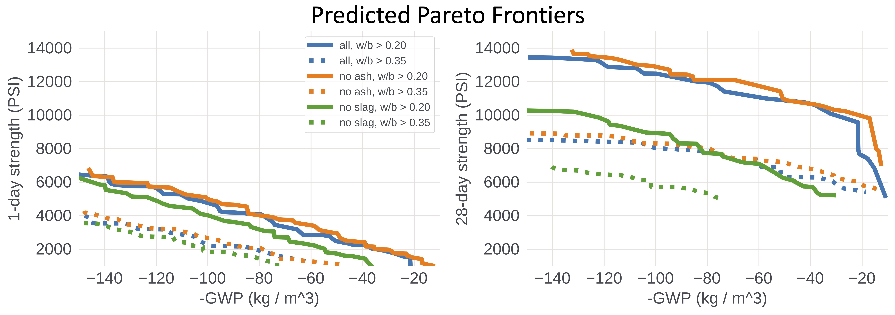
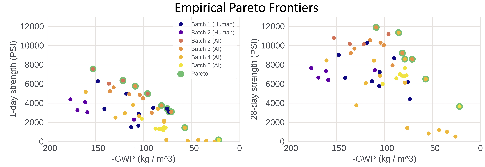
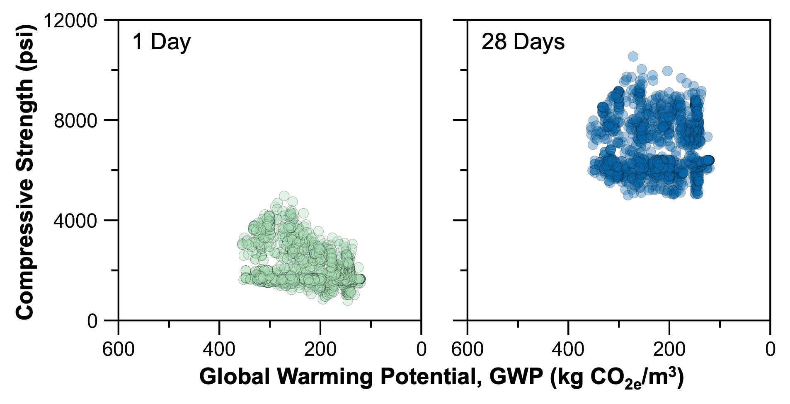

# BOxCrete: Bayesian Optimization for Sustainable Concrete Mix Design

Concrete, the second most widely used material in the world, accounts for **6–8% of global anthropogenic CO₂ emissions**, largely due to Portland cement production (~0.8 tons CO₂ per ton of cement). Partial replacement with Supplementary Cementitious Materials (SCMs) such as fly ash, slag, and natural pozzolan reduces embodied carbon and often improves durability, but high SCM usage makes compressive strength a highly nonlinear function of multiple interacting mix parameters, rendering traditional design empirical and trial-and-error driven. To systematically navigate this complex composition space, data-driven frameworks are needed. 
Here, we introduce BOxCrete, an open-source Bayesian optimization framework for probabilistic strength curve prediction and sustainable mix design. 
We invite researchers and practitioners from all disciplines including AI, machine learning, computer science, materials science, and civil engineering
to collaborate on discovering more sustainable concrete formulations that are applicable
to a wide array of construction projects, at scale.
For more information,
please see ["BOxCrete: A Bayesian Optimization Open-Source AI Model for Concrete Strength Forecasting and Mix Optimization"](https://arxiv.org/abs/2603.21525).

This repository contains probabilistic models and data for the

1) Compressive strength of concrete and mortar mixes
2) The associated global warming potential (GWP)

as a function of their composition, consisting of cement, fly ash, slag, fine and coarse aggregate, admixtures, and water, to name a few basic ingredients. See `boxcrete/models.py` for implementation details.

### Included Data

- **BOxCrete data** (`data/boxcrete_data.csv`): Combined mortar and concrete mix compositions with strength measurements at multiple curing ages, GWP values, and multiple material sources. This is the single unified dataset used for all model training.

## Installation

Install directly from GitHub (no cloning required):
```bash
pip install git+https://github.com/facebookresearch/SustainableConcrete.git
```

Or install from source for development:
```bash
git clone https://github.com/facebookresearch/SustainableConcrete.git
cd SustainableConcrete
pip install -e .
```

For development (includes testing and linting tools):
```bash
pip install -e ".[dev]"
```

For running notebooks:
```bash
pip install -e ".[notebooks]"
```

## Usage

```python
import torch
from boxcrete.utils import load_concrete_strength, get_bounds
from boxcrete.models import SustainableConcreteModel
from boxcrete.plotting import plot_strength_curve

# Load data and fit models
data = load_concrete_strength()
data.bounds = get_bounds(data.X_columns)
model = SustainableConcreteModel(strength_days=[1, 28])
model.fit_gwp_model(data)
model.fit_strength_model(data)

# model_list[0] = GWP, model_list[1] = 1-day strength, model_list[2] = 28-day strength
model_list = model.get_model_list()

# Plot strength curves: 100% cement vs 60% fly ash + 40% cement
cols = data.X_columns[:-1]  # composition columns (without Time)
compositions = torch.zeros(2, len(cols))
compositions[0, cols.index("Cement (kg/m3)")] = 500.0  # 100% cement
compositions[1, cols.index("Cement (kg/m3)")] = 200.0  # 40% cement
compositions[1, cols.index("Fly Ash (kg/m3)")] = 300.0  # 60% fly ash
plot_strength_curve(model, compositions)
```

The models can be used for a variety of tasks, including but not limited to
1) Continuous-time strength curve predictions with uncertainty bands for a user-specified concrete mix.
2) Experimental design: suggesting promising concrete mixtures to be tested in a lab,
3) The computation of optimal strength-GWP trade-offs based on user-specified (possibly location-specific) constraints.

# Examples

## Compressive Strength Model

The `SustainableConcreteModel` in [`boxcrete/models.py`](boxcrete/models.py) includes a strength_model that predicts the evolution of compressive strength as a function of mixture composition. A demo is provided in [`notebooks/strength_curve_prediction_demo.ipynb`](notebooks/strength_curve_prediction_demo.ipynb), which demonstrates how the model can be used to predict the full strength development curve for any user-specified mix. A comprehensive tutorial covering prediction, calibration, Pareto frontiers, and gradient-based experimental design is available in [`notebooks/prediction_and_optimization_tutorial.ipynb`](notebooks/prediction_and_optimization_tutorial.ipynb). The model is based on Gaussian Process (GP) regression and incorporates custom modeling steps to ensure physically consistent strength evolution and calibrated uncertainty.

### Strength Curve Predictions

The following figure shows predicted strength curves for two compositions: portland cement (blue) and a mix with high cement substitution (green). The model captures the distinct strength development trajectories associated with different binder chemistries while providing physically consistent uncertainty estimates.

<p align="center">
  
</p>

### Model Calibration

#### Cross-Validation on Independent Test Set

When the model is trained on the full training dataset and evaluated on an independent set of mixtures, it demonstrates strong predictive performance. The predicted compressive strengths closely match the experimentally measured values across the range of mixes and curing ages.

<p align="center">
  
</p>

#### Training Set Calibration

When trained on the mortar and concrete mix strength data contained in this repository, the training set predictions also look sensible and well calibrated.

<p align="center">
  
</p>

## Experimental Design

### Inferring Optimal Trade-Offs under Constraints

While the previous section focused on using the models to predict strength curves,
we can also use the trained model to predict what the optimal trade-offs between GWP and strength
are likely to look like under constraints on the concrete composition
that were not necessarily present during the training of the model.

In particular, the figure below shows the predicted Pareto frontiers
of GWP and strength subject to two constraints on the water-to-binder ratio,
i.e.:

1) water-to-binder ratio > 0.2 (solid lines), and
2) water-to-binder ratio > 0.35 (dashed lines),

as well as constraints on ingredients:

1) no constraints (blue),
2) no fly ash (orange), and
3) no slag (green).

<p align="center">
  
</p>

Notably, while the figure is purely based on model predictions,
the trends in the figure conform to expert knowledge.
In particular,
- the increase in the minimum water-to-binder ratio has an outsize negative effect
on the evolution of strength,
- removing fly ash from the composition appears to have negligible effect during the time window we consider (< 28 days), and
- removing slag from the composition has a significant negative effect on strength, similar to the increase in the water-to-binder ratio.

These are just a few insights we can gain from querying the model,
and we believe that many more questions about the behavior of concrete
can be investigated in a similar way.

From a practical perspective, the insight that the exclusion of slag - a by-product of steel production -
is more significant than the exclusion of fly ash - a by-product of coal power plants -
can inform site selection
for large construction projects that seek to minimize carbon impact.

### Empirical Pareto Frontier Evolution

The probabilistic model for compressive strength can in addition be used to design new concrete mixtures that are likely to exhibit an optimal trade-off between strength and GWP.
The following figure shows the evolution of the empirical Pareto frontier,
i.e. the points with empirically optimal trade-offs,
as a function of our experimental batches.

<p align="center">
  
</p>

Importantly, the experimental design methodology has been able to propose mortar mixes
that have experimentally proven to exhibit superior trade-offs between GWP and strength
compared (orange-yellow) to human-designed mixes (blue-purple).

### Multi-Objective Optimization (Concrete Data)

The framework also enables multi-objective optimization of early-age (1-day) and later-age (28-day) compressive strength alongside Global Warming Potential (GWP). By systematically exploring the composition space, BOxCrete can generate candidate mixes that balance structural performance requirements with carbon reduction targets.

<p align="center">
  
</p>

The following figure shows the distribution of model-generated mixes plotted together with the training dataset, illustrating how the optimization explores the design space while remaining guided by experimentally validated compositions.

<p align="center">
  
</p>

# Citing

If you use the data or models contained in this repository, please cite
["BOxCrete: A Bayesian Optimization Open-Source AI Model for Concrete Strength Forecasting and Mix Optimization"](https://arxiv.org/abs/2603.21525):
```
@misc{baten2026boxcretebayesianoptimizationopensource,
      title={BOxCrete: A Bayesian Optimization Open-Source AI Model for Concrete Strength Forecasting and Mix Optimization}, 
      author={Bayezid Baten and M. Ayyan Iqbal and Sebastian Ament and Julius Kusuma and Nishant Garg},
      year={2026},
      eprint={2603.21525},
      archivePrefix={arXiv},
      primaryClass={cs.LG},
      url={https://arxiv.org/abs/2603.21525}, 
}
```

## License
`SustainableConcrete` is released under the MIT license, as found in the LICENSE file.