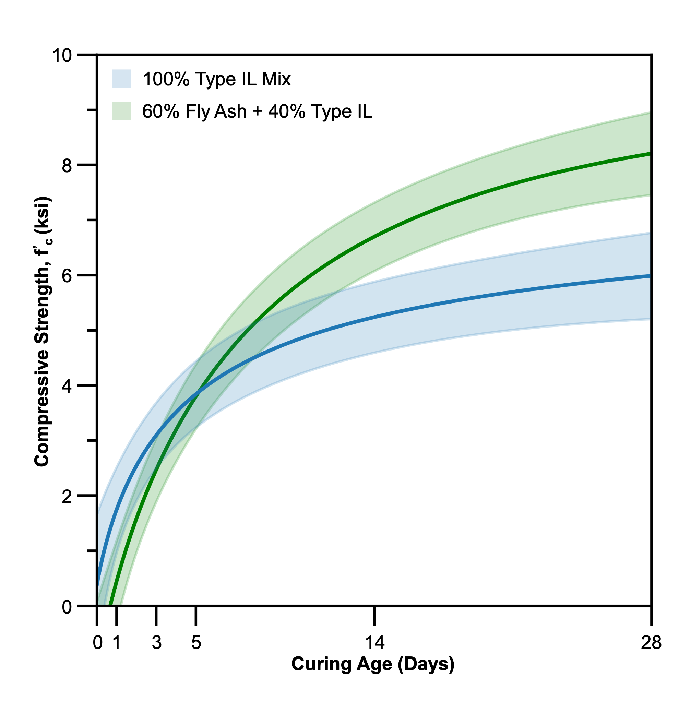
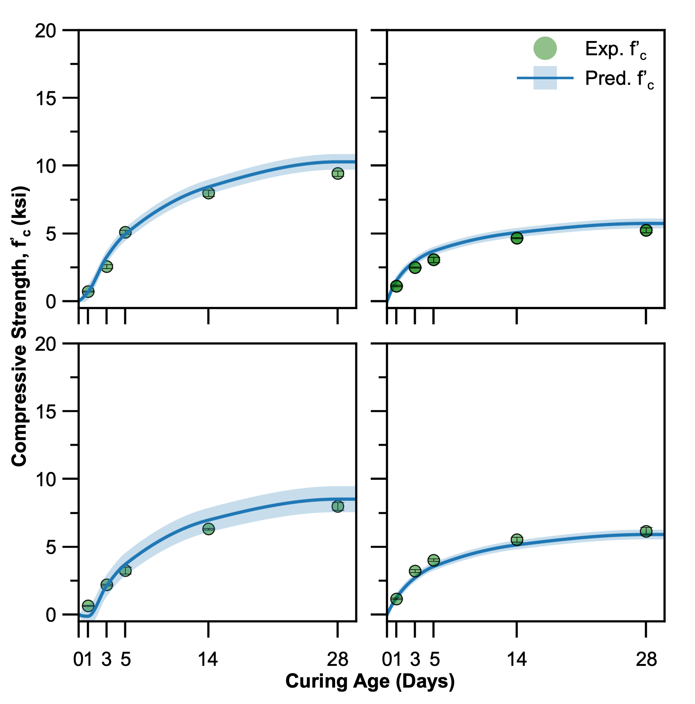
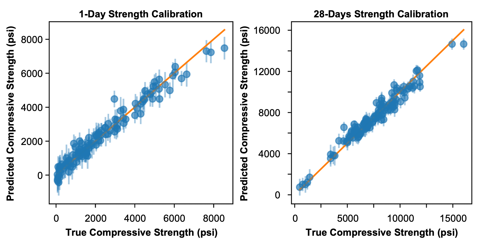
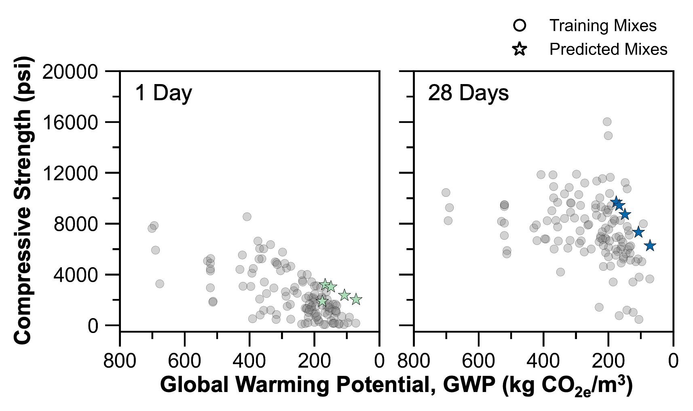

# BOxCrete: A Bayesian Optimization open-source AI Model for Concrete Mix Design & Optimization

Concrete, the second most widely used material in the world, accounts for **6–8% of global anthropogenic CO₂ emissions**, largely due to Portland cement production (~0.8 tons CO₂ per ton of cement). Partial replacement with Supplementary Cementitious Materials (SCMs) such as fly ash, slag, and natural pozzolan reduces embodied carbon and often improves durability, but high SCM usage makes compressive strength a highly nonlinear function of multiple interacting mix parameters, rendering traditional design empirical and trial-and-error driven. To systematically navigate this complex composition space, data-driven frameworks are needed. Here, we introduce BOxCrete, an open-source Bayesian optimization framework for probabilistic strength curve prediction and sustainable mix design. 

This repository contains probabilistic models and data for the

1) Compressive strength of concrete and mortar mixes
2) The associated global warming potential (GWP)

as a function of their composition, consisting of cement, fly ash, slag, fine and coarse aggregate, admixtures, and water, to name a few basic ingredients. See the ['BOxCrete_models.py'](BOxCrete_models.py) file for implementation details.

The models can be used for a variety of tasks, including but not limited to
1)	Continuous-time strength curve predictions with uncertainty bands for a user-specified concrete mix.
2)	Experimental design: suggesting promising concrete mixtures to be tested in a lab,
3)	The computation of optimal strength-GWP trade-offs based on user-specified (possibly location-specific) constraints.


# Examples

## Compressive Strength Model

The `SustainableConcreteModel` in ['BOxCrete_models.py'](BOxCrete_models.py) includes a strength_model that predicts the evolution of compressive strength as a function of mixture composition. A tutorial is provided in [notebooks/BOxCrete Concrete Strength Prediction for GitHub.ipynb](<notebooks/BOxCrete Concrete Strength Prediction for GitHub.ipynb>), which demonstrates how the model can be used to predict the full strength development curve for any user-specified mix. The model is based on Gaussian Process (GP) regression and incorporates custom modeling steps to ensure physically consistent strength evolution and calibrated uncertainty. Example strength curve predictions generated using the notebook are shown in the figures below.

<p align="center">
  
</p>

The figure shows predicted strength curves for two compositions: portland cement (blue) and a mix with high cement substitution (green). The model captures the distinct strength development trajectories associated with different binder chemistries while providing physically consistent uncertainty estimates.

When the model is trained on the full training dataset and evaluated on an independent set of mixtures, it similarly demonstrates strong predictive performance. As shown in the figure below, the predicted compressive strengths closely match the experimentally measured values across the range of mixes and curing ages, indicating that the model successfully generalizes beyond the training data and provides reliable strength forecasts.

<p align="center">
  
</p>

Further, when trained on the mortar and concrete mix strength data contained in this repository, the training set predictions also look sensible and well calibrated, as the next figure shows.

<p align="center">
  
</p>

## Experimental Design

The probabilistic compressive strength model can also be used to design new concrete mixtures that achieve optimal trade-offs between mechanical performance and environmental impact. In particular, the framework enables multi-objective optimization of early-age (1-day) and later-age (28-day) compressive strength alongside Global Warming Potential (GWP). By systematically exploring the composition space, BOxCrete can generate candidate mixes that balance structural performance requirements with carbon reduction targets. 

As illustrated in the figure below, the model identifies a Pareto front capturing the trade-off between 1-day strength, 28-day strength, and GWP across candidate mixtures.

<p align="center">
  
</p>

Another figure shows the distribution of model-generated mixes plotted together with the training dataset, illustrating how the optimization explores the design space while remaining guided by experimentally validated compositions.

<p align="center">
  
</p>

# Citing

If you use the data or models contained in this repository, please cite
["Sustainable Concrete via Bayesian Optimization"](https://arxiv.org/abs/2310.18288):
```
@misc{ament2023sustainable,
      title={Sustainable Concrete via Bayesian Optimization},
      author={Sebastian Ament and Andrew Witte and Nishant Garg and Julius Kusuma},
      year={2023},
      eprint={2310.18288},
      archivePrefix={arXiv},
      primaryClass={cs.LG}
}
```

## License
`SustainableConcrete` is MIT licensed, as found in the LICENSE file.
